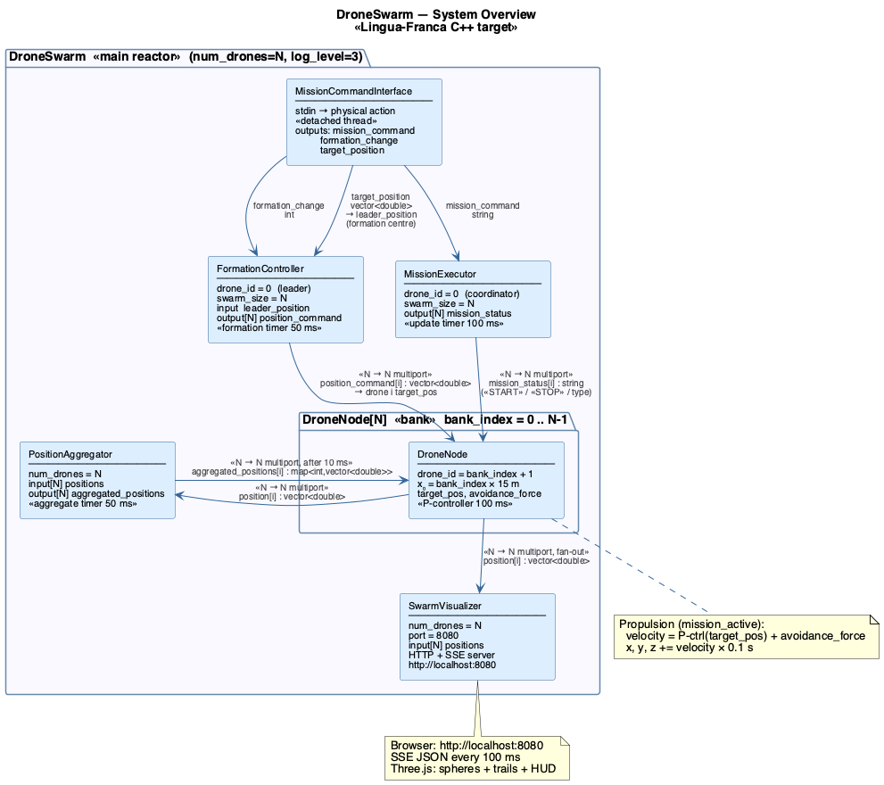
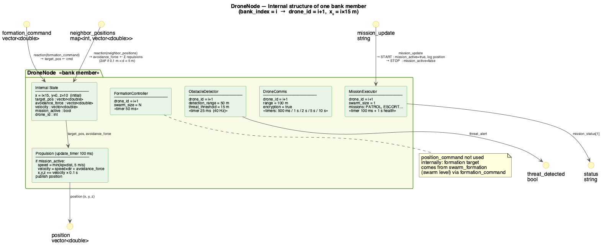
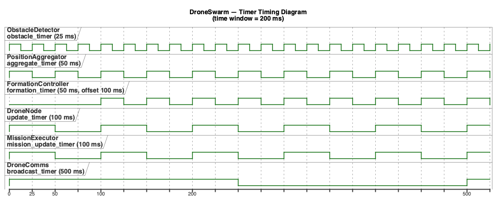
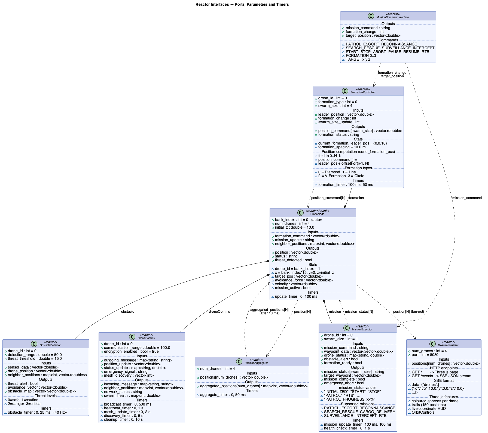
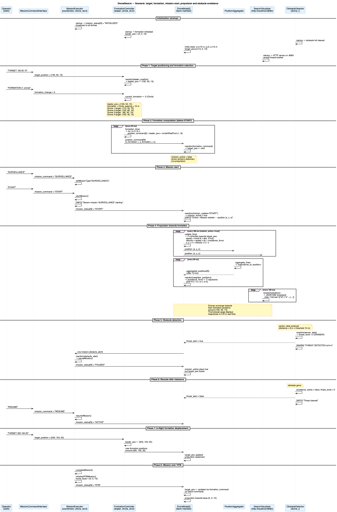

# DroneSwarm System Architecture

> Modelling language: **Lingua-Franca** (C++ target)
> Main file: `src/DroneSwarm.lf`

---

## Table of Contents

1. [Overview](#1-overview)
2. [Project Structure](#2-project-structure)
3. [Reactors](#3-reactors)
   - 3.1 [DroneSwarm — main reactor](#31-droneswarm--main-reactor)
   - 3.2 [MissionCommandInterface](#32-missioncommandinterface)
   - 3.3 [PositionAggregator](#33-positionaggregator)
   - 3.4 [DroneNode — bank](#34-dronenode--bank)
   - 3.5 [FormationController](#35-formationcontroller)
   - 3.6 [ObstacleDetector](#36-obstacledetector)
   - 3.7 [MissionExecutor](#37-missionexecutor)
   - 3.8 [DroneComms](#38-dronecomms)
   - 3.9 [SwarmVisualizer](#39-swarmvisualizer)
4. [Data Flow and Connections](#4-data-flow-and-connections)
5. [Physics Simulation](#5-physics-simulation)
6. [Timing](#6-timing)
7. [Runtime Configuration](#7-runtime-configuration)
8. [Runtime Logging](#8-runtime-logging)
9. [Communication Patterns](#9-communication-patterns)
10. [Diagrams](#10-diagrams)
11. [Live Visualization](#11-live-visualization)

---

## 1. Overview

**DroneSwarm** is a real-time reactive application modelling a UAV drone swarm. It is developed in **Lingua-Franca** targeting **C++** and relies on the `reactor-cpp` reactive framework.

Each drone is an instance of a **bank** of `DroneNode` reactors. Four subsystems — formation, obstacle detection, mission execution and communications — are instantiated inside every drone. The number of drones and the logging level are **configurable at runtime**:

```bash
./bin/DroneSwarm --num_drones 6 --log_level 2
```



---

## 2. Project Structure

```
src/
├── DroneSwarm.lf              # main reactor + DroneNode + PositionAggregator
├── MissionCommandInterface.lf # stdin interface → mission/formation commands
├── FormationController.lf     # formation computation (diamond, line, V, circle)
├── ObstacleDetector.lf        # sensor fusion, threat detection
├── MissionExecutor.lf         # mission lifecycle and waypoint management
├── DroneComms.lf              # mesh network, heartbeat, encryption
├── SwarmVisualizer.lf         # HTTP/SSE server for live 3-D browser visualization
├── swarm_viz_html.hh          # embedded Three.js page (raw string, kept out of .lf)
└── uav_logging.hh             # logging macros with runtime level filtering

doc/
├── architecture.md        # this document
└── diagrams/
    ├── 01_system_overview.puml      # system overview
    ├── 02_drone_node_internals.puml # internal structure of one DroneNode
    ├── 03_reactors_interfaces.puml  # interfaces (ports, parameters, timers)
    ├── 04_sequence_mission.puml     # mission + obstacle scenario
    └── 05_timing.puml               # timer timing diagram
```

---

## 3. Reactors

### 3.1 DroneSwarm — main reactor

**File:** `src/DroneSwarm.lf`

Top-level reactor. Orchestrates the entire swarm. A `startup` reaction (`log_level_setting`) initialises the global logging level before any other activity.

| Parameter | Default | Description |
|-----------|---------|-------------|
| `num_drones` | 4 | number of drones in the swarm |
| `log_level` | 3 | logging level (0–4, see §8) |

**Instantiated reactors:**

| Instance | Type | Role |
|----------|------|------|
| `drones[N]` | `DroneNode` (bank) | N swarm drones |
| `aggregator` | `PositionAggregator` | aggregates N positions |
| `swarm_formation` | `FormationController` (drone_id=0, swarm_size=N) | swarm-level formation leader |
| `mission_coordinator` | `MissionExecutor` (drone_id=0, swarm_size=N) | mission coordinator |
| `cmd_interface` | `MissionCommandInterface` | stdin command interface |
| `viz` | `SwarmVisualizer` (num_drones=N) | live 3-D HTTP/SSE visualization server |

**Main connections (all N → N):**

```
cmd_interface.mission_command        → mission_coordinator.mission_command
cmd_interface.formation_change       → swarm_formation.formation_change
cmd_interface.target_position        → swarm_formation.leader_position
swarm_formation.position_command[N]  → drones.formation_command     (N→N)
mission_coordinator.mission_status[N]→ drones.mission_update        (N→N)
drones.position[N]                   → aggregator.positions[N]      (N→N)
aggregator.aggregated_positions[N]   → drones.neighbor_positions     (N→N, after 10 ms)
drones.position[N]                   → viz.positions[N]             (N→N, fan-out)
```

---

### 3.2 MissionCommandInterface

**File:** `src/MissionCommandInterface.lf`

Bridge between the human operator and the reactive system. Uses an LF **physical action** to inject stdin commands into the reactive timeline in a thread-safe manner: a detached thread reads `std::cin` and calls `stdin_command.schedule(line)`.

| Output port | Type | Destination |
|-------------|------|-------------|
| `mission_command` | `string` | `mission_coordinator.mission_command` |
| `formation_change` | `int` | `swarm_formation.formation_change` |
| `target_position` | `vector<double>` | `swarm_formation.leader_position` |

**Recognised commands:**

| Category | Commands |
|----------|----------|
| Mission type | `PATROL` `ESCORT` `RECONNAISSANCE` `SEARCH_RESCUE` `CARGO_DELIVERY` `SURVEILLANCE` `INTERCEPT` |
| Control | `START` `STOP` `ABORT` `PAUSE` `RESUME` `RTB` |
| Formation | `FORMATION 0` (diamond) `FORMATION 1` (line) `FORMATION 2` (V) `FORMATION 3` (circle) |
| Position | `TARGET x y z` (formation centre — updates `leader_position` in FormationController) |
| Help | `HELP` |

**Example session:**
```
=== DroneSwarm — Command Interface ===
> PATROL
[MISSION] → PATROL
> START
[MISSION] → START
[INFO]  Drone 0: Swarm mission 'PATROL' starting — broadcasting START to all drones
[INFO]  Drone 1: Mission started — position (0.00, 0.00, 10.00)
[INFO]  Drone 2: Mission started — position (15.00, 0.00, 10.00)
[INFO]  Drone 3: Mission started — position (30.00, 0.00, 10.00)
[INFO]  Drone 4: Mission started — position (45.00, 0.00, 10.00)
> FORMATION 3
[FORMATION] → circle
> TARGET 100 50 20
[TARGET] → (100.00, 50.00, 20.00)
> PAUSE
[MISSION] → PAUSE
> RTB
[MISSION] → RTB
```

---

### 3.3 PositionAggregator

**File:** `src/DroneSwarm.lf`

Collects the positions of all drones through an **input multiport** of width `num_drones` and publishes the aggregated map every 50 ms through an **output multiport** of the same width.

| Port | Type | Width |
|------|------|-------|
| `positions[num_drones]` | `vector<double>` | N inputs |
| `aggregated_positions[num_drones]` | `map<int, vector<double>>` | N outputs |

The output multiport ensures a clean N→N connection to `drones.neighbor_positions` (see §9).

| Timer | Period |
|-------|--------|
| `aggregate_timer` | 50 ms |

---

### 3.4 DroneNode — bank

**File:** `src/DroneSwarm.lf`

Represents a single drone. Instantiated N times via the Lingua-Franca **bank** mechanism. The `bank_index` (0-based) is automatically assigned by the runtime.

| Parameter | Value | Description |
|-----------|-------|-------------|
| `bank_index` | auto 0..N-1 | index in the bank (auto-assigned) |
| `num_drones` | 4 | total swarm size |
| `initial_z` | 10.0 m | initial altitude |

**Initial positions:** drones are spread along the X axis with 15 m spacing:

```
Drone 1 (bank_index=0) : (  0, 0, 10)
Drone 2 (bank_index=1) : ( 15, 0, 10)
Drone 3 (bank_index=2) : ( 30, 0, 10)
Drone 4 (bank_index=3) : ( 45, 0, 10)
```

This spacing ensures drones do not overlap at startup, allowing collision avoidance (active for distances 0.1–5 m) to work correctly from the first mission moments.

**Internal state:**

| State | Type | Initial value | Role |
|-------|------|---------------|------|
| `drone_id` | `int` | `bank_index + 1` | 1-based identifier |
| `x`, `y`, `z` | `double` | `bank_index*15`, `0`, `initial_z` | current position |
| `target_pos` | `vector<double>` | `{bank_index*15, 0, initial_z}` | propulsion target position |
| `avoidance_force` | `vector<double>` | `{0, 0, 0}` | repulsion force (collision avoidance) |
| `velocity` | `vector<double>` | `{0, 0, 0}` | resulting velocity |
| `mission_active` | `bool` | `false` | enables propulsion |

**Ports:**

| Port | Type | Direction | Source / Destination |
|------|------|-----------|----------------------|
| `formation_command` | `vector<double>` | input | `swarm_formation.position_command[i]` |
| `mission_update` | `string` | input | `mission_coordinator.mission_status[i]` |
| `neighbor_positions` | `map<int, vector<double>>` | input | `aggregator.aggregated_positions[i]` |
| `position` | `vector<double>` | output | `aggregator.positions[i]` |
| `status` | `string` | output | (not connected downstream) |
| `threat_detected` | `bool` | output | (not connected downstream) |

**Reactions:**

| Trigger | Effect |
|---------|--------|
| `formation_command` | updates `target_pos` (drone moves towards this target) |
| `mission_update = "START"` | sets `mission_active = true`, logs current position |
| `mission_update = "STOP"` | sets `mission_active = false` |
| `update_timer` (100 ms) | publishes `position`, applies propulsion + integration when `mission_active` |
| `neighbor_positions` | recomputes `avoidance_force` (repulsion for distances 0.1–5 m) |

**Instantiated subsystems:**

```
formation  = FormationController(drone_id = bank_index+1, swarm_size = num_drones)
obstacle   = ObstacleDetector(drone_id = bank_index+1)
mission    = MissionExecutor(drone_id = bank_index+1, swarm_size = 1)
droneComms = DroneComms(drone_id = bank_index+1)
```



---

### 3.5 FormationController

**File:** `src/FormationController.lf`

Computes the target position of each drone within the formation. Instantiated once as the swarm-level leader controller (`swarm_formation`, drone_id=0, swarm_size=N) in `DroneSwarm`, and once per `DroneNode` for local computation.

| Parameter | Default | Description |
|-----------|---------|-------------|
| `drone_id` | 0 | identifier (0 = leader) |
| `formation_type` | 0 | initial formation type |
| `swarm_size` | 4 | number of follower drones |

**Input ports:**

| Port | Type | Source |
|------|------|--------|
| `formation_change` | `int` | `cmd_interface.formation_change` |
| `leader_position` | `vector<double>` | `cmd_interface.target_position` |

The `leader_position` port receives the formation centre set by the `TARGET x y z` command. When not set, the formation is centred on the origin.

**Formation types:**

| Value | Name | Algorithm |
|-------|------|-----------|
| 0 | Diamond | 4 cardinal points; general circle for N > 4 |
| 1 | Line | linear arrangement behind the leader |
| 2 | V-Formation | alternating left/right |
| 3 | Circle | equidistant circle, radius `formation_spacing = 10 m` |

**Output:** `output[swarm_size] position_command : vector<double>` — one {x, y, z} position per follower drone.

**Dynamic update:** the `formation_change : int` port allows changing the formation at runtime.

**Position computation — `calculateFormationPositionFor(drone_index, total)`:**

The `send_formation_pos` reaction loops over all swarm drones and computes a **unique** target position for each:

```cpp
for (int i = 0; i < n; i++) {
    position_command[i].set(calculateFormationPositionFor(i + 1, n));
}
```

The method `calculateFormationPositionFor(drone_index, total)` delegates to one of four offset methods, passing `drone_index` (not `this->drone_id`):

| Offset method | Formation |
|---------------|-----------|
| `calculateDiamondOffsetFor(drone_index, total)` | Diamond |
| `calculateLineOffsetFor(drone_index, total)` | Line |
| `calculateVOffsetFor(drone_index, total)` | V-Formation |
| `calculateCircleOffsetFor(drone_index, total)` | Circle |

> **Bug fix:** the old `calculateFormationPosition()` method used `this->drone_id`, which is always 0 for the swarm-level leader (`swarm_formation`). All drones therefore received `{0, 0, 10}` as their target. With `calculateFormationPositionFor(i+1, n)`, each drone[i] receives a distinct target based on its formation index.

| Timer | Offset | Period |
|-------|--------|--------|
| `formation_timer` | 100 ms | 50 ms |

---

### 3.6 ObstacleDetector

**File:** `src/ObstacleDetector.lf`

Processes sensor data (LIDAR / cameras) in polar coordinates `[distance, angle, elevation]`, builds an obstacle map and computes avoidance vectors.

| Parameter | Default | Description |
|-----------|---------|-------------|
| `drone_id` | 0 | drone identifier |
| `detection_range` | 50.0 m | detection range |
| `threat_threshold` | 15.0 m | threat threshold |

**Threat levels:**

| Level | Value | Distance |
|-------|-------|----------|
| Safe | 0 | > 15 m |
| Caution | 1 | ≤ 15 m |
| Danger | 2 | ≤ 10 m |
| Critical | 3 | ≤ 5 m |

| Timer | Period |
|-------|--------|
| `obstacle_timer` | 25 ms (40 Hz) |

---

### 3.7 MissionExecutor

**File:** `src/MissionExecutor.lf`

Manages the mission lifecycle: waypoint loading, progress tracking, timeout management, automatic return-to-base (RTB) on critical level.

| Parameter | Default | Description |
|-----------|---------|-------------|
| `drone_id` | 0 | drone identifier |
| `swarm_size` | 1 | output multiport width (> 1 only for the swarm coordinator) |

**Output ports:**

| Port | Type | Description |
|------|------|-------------|
| `mission_status[swarm_size]` | `string` | status broadcast to all drones |
| `target_waypoint` | `vector<double>` | next waypoint |
| `mission_complete` | `bool` | mission completion signal |
| `emergency_abort` | `bool` | emergency abort signal |

**`mission_status` values:**

| Value | Trigger |
|-------|---------|
| `"INITIALIZED"` | startup |
| `"START"` | `START` command (sets `mission_active = true` in each DroneNode) |
| `"STOP"` | `STOP` or `ABORT` command (sets `mission_active = false`) |
| `"PATROL"`, `"RTB"`, … | mission type change |
| `"PATROL_PROGRESS_xx%"` | periodic progress update (100 ms) |

**Supported missions:**

| Mission | Timeout | Priority | Waypoint tolerance |
|---------|---------|----------|--------------------|
| PATROL | 30 min | 1 | 2 m |
| RECONNAISSANCE | 15 min | 2 | 2 m |
| SEARCH_RESCUE | 60 min | 3 | 1 m |
| INTERCEPT | 10 min | 3 | 5 m |
| RTB | — | 2 | 2 m |

**Automatic RTB trigger:** battery < 20 %, fuel < 15 %, system health < 50 %.

| Timer | Period | Role |
|-------|--------|------|
| `mission_update_timer` | 100 ms | waypoint progression |
| `health_check_timer` | 1 s | critical level monitoring |

---

### 3.8 DroneComms

**File:** `src/DroneComms.lf`

Manages the inter-drone mesh network: peer discovery, heartbeat, message routing, network health monitoring.

| Parameter | Default | Description |
|-----------|---------|-------------|
| `drone_id` | 0 | drone identifier |
| `communication_range` | 100.0 m | radio range |
| `encryption_enabled` | true | XOR encryption |

**Message types:** POSITION_UPDATE, HEARTBEAT, EMERGENCY (3 retransmissions), mesh routing.

| Timer | Period | Role |
|-------|--------|------|
| `broadcast_timer` | 500 ms | position broadcast |
| `heartbeat_timer` | 1 s | neighbour monitoring |
| `mesh_update_timer` | 2 s | topology update |
| `discovery_timer` | 5 s | new drone discovery |
| `cleanup_timer` | 10 s | prune inactive neighbours (> 30 s) |

---

### 3.9 SwarmVisualizer

**Files:** `src/SwarmVisualizer.lf`, `src/swarm_viz_html.hh`

Live visualization reactor. Embeds a minimal HTTP/SSE server (POSIX sockets, no external dependencies) that streams all drone positions to a web browser displaying a Three.js 3-D scene.

| Parameter | Default | Description |
|-----------|---------|-------------|
| `num_drones` | 4 | number of drones to visualize |
| `port` | 8080 | TCP listening port of the HTTP server |

**Input port:**

| Port | Type | Source |
|------|------|--------|
| `positions[num_drones]` | `vector<double>` | `drones.position[N]` (fan-out from DroneSwarm) |

**HTTP/SSE server operation:**

The server starts in a detached thread during the `startup` reaction. It handles two routes:

| Route | Behaviour |
|-------|-----------|
| `GET /` | Serves the Three.js HTML page defined in `swarm_viz_html.hh` (raw string literal) |
| `GET /events` | Opens an SSE stream; sends a JSON object every 100 ms and a keepalive comment every 15 s |

SSE message format:
```json
{"drones":[{"id":1,"x":0.0,"y":0.0,"z":10.0},{"id":2,"x":5.0,"y":-5.0,"z":10.0},...]}
```

Each SSE connection is handled in its own detached client thread. The HTML page is kept in `swarm_viz_html.hh` as a raw string literal to avoid conflicts with the Lingua-Franca parser (braces, quotes, etc.).

**Three.js page features:**

- Coloured spheres for each drone (colour by index)
- 150-point trails per drone
- Drone number labels
- HUD displaying live x/y/z coordinates
- OrbitControls: rotate, zoom, pan with mouse
- Ground grid as spatial reference

**Connection in DroneSwarm:**

```lf
viz = new SwarmVisualizer(num_drones = num_drones)
drones.position -> viz.positions
```

**Usage:** start the program, then open `http://localhost:8080` in any browser.

---

## 4. Data Flow and Connections

```
┌──────────────────────────────────────────────────────────────────┐
│                    DroneSwarm (N drones)                         │
│                                                                  │
│  stdin ──► cmd_interface                                         │
│                │                                                 │
│                ├──[mission_command]──► mission_coordinator       │
│                ├──[formation_change]──► swarm_formation          │
│                └──[target_position]──► swarm_formation           │
│                         (leader_position: formation centre)      │
│                                                                  │
│  swarm_formation ──[position_command × N]──► drones[N]          │
│         multiport N → N (unique target per drone)               │
│                                                                  │
│  mission_coordinator ──[mission_status × N]──► drones[N]        │
│         multiport N → N (same status broadcast to all)          │
│                                                                  │
│  drones[N] ──[position × N]──► aggregator                       │
│         multiport N → N (one position per drone)                │
│                                                                  │
│  drones[N] ──[position × N]──► viz.positions[N]                 │
│         multiport N → N (fan-out: live visualization)           │
│                                                                  │
│  aggregator ──[aggregated_positions × N]──► drones[N]           │
│         multiport N → N, after 10 ms (neighbour positions)      │
└──────────────────────────────────────────────────────────────────┘

Internal to each DroneNode:
  formation_command  ──► target_pos (reaction formation_command)
  neighbor_positions ──► avoidance_force (reaction neighbor_positions)
  update_timer       ──► propulsion + integration + publish position
  obstacle.threat_alert  ──► threat_detected (output)
  mission.mission_status ──► status (output)
```

---

## 5. Physics Simulation

This section describes the kinematic simulation model implemented in `DroneNode`.

### 5.1 Initial Positions

Drones start in a line along the X axis, spaced 15 m apart:

```
x₀ = bank_index × 15    y₀ = 0    z₀ = initial_z (10 m by default)
```

This spacing ensures drones do not overlap and that collision avoidance (active for distances 0.1–5 m) does not perturb the initial state.

### 5.2 Target Position (target_pos)

`target_pos` is the position the drone is flying towards. It is updated by:

- **`reaction(formation_command)`**: the swarm-level `FormationController` sends a formation position every 50 ms. This becomes the new `target_pos`.
- At startup, `target_pos` equals the initial position (the drone stays stationary until `START`).

### 5.3 Propulsion — Proportional Controller (P-controller)

Active only when `mission_active = true` (after `START` command).

Computed in `reaction(update_timer)` at every 100 ms step:

```
dx = target_pos.x − x
dy = target_pos.y − y
dz = target_pos.z − z
dist = √(dx² + dy² + dz²)

if dist > 0.1 m:
    speed = min(kp × dist, max_speed)   # kp = 0.8, max_speed = 5 m/s
    velocity = speed × (dx, dy, dz) / dist  +  avoidance_force

else:
    velocity = avoidance_force           # at goal: avoidance drift only
```

Propulsion parameters:

| Parameter | Value | Description |
|-----------|-------|-------------|
| `kp` | 0.8 | proportional gain |
| `max_speed` | 5.0 m/s | velocity cap |
| `dt` | 0.1 s | integration step (timer period) |

Integration (explicit Euler method):
```
x += velocity.x × dt
y += velocity.y × dt
z += velocity.z × dt
```

### 5.4 Collision Avoidance (avoidance_force)

Computed in `reaction(neighbor_positions)` each time the aggregated position map is received (every ~50 ms + 10 ms delay):

```
for each neighbour j:
    (dx, dy, dz) = current_position − neighbour_j_position   # away vector
    distance = √(dx² + dy² + dz²)

    if 0.1 m < distance < 5.0 m:
        repulsion = 2.0 / distance²
        avoidance_force += repulsion × (dx, dy, dz) / distance
```

The avoidance force is **decoupled from propulsion**: it is accumulated in the `avoidance_force` state during the `neighbor_positions` reaction, then **added** to the propulsion velocity inside `update_timer`. This ensures avoidance does not override the direction towards the target.

Influence zones:

| Zone | Distance | Effect |
|------|----------|--------|
| Out of range | > 5.0 m | none |
| Active | 0.1–5.0 m | repulsive force ∝ 1/d² |
| Contact | < 0.1 m | ignored (avoids division by zero) |

### 5.5 Full Per-Step Dynamics

```
                 ┌─────────────────────────────────────┐
neighbor_pos ──► │ reaction(neighbor_positions)         │
                 │   avoidance_force ← Σ repulsions     │
                 └──────────────────┬──────────────────┘
                                    │ state
                 ┌──────────────────▼──────────────────┐
formation_cmd ──►│ target_pos ← cmd                     │
                 └──────────────────┬──────────────────┘
                                    │ state
                 ┌──────────────────▼──────────────────┐
update_timer ──► │ reaction(update_timer)               │
                 │   velocity ← P-ctrl(target) + avoid  │
                 │   (x, y, z) += velocity × dt         │
                 │   position.set({x, y, z})             │
                 └─────────────────────────────────────┘
```

---

## 6. Timing

| Reactor | Timer | Offset | Period | Frequency |
|---------|-------|--------|--------|-----------|
| ObstacleDetector | `obstacle_timer` | 0 | 25 ms | 40 Hz |
| PositionAggregator | `aggregate_timer` | 0 | 50 ms | 20 Hz |
| FormationController | `formation_timer` | 100 ms | 50 ms | 20 Hz |
| DroneNode | `update_timer` | 0 | 100 ms | 10 Hz |
| MissionExecutor | `mission_update_timer` | 100 ms | 100 ms | 10 Hz |
| MissionExecutor | `health_check_timer` | 0 | 1 s | 1 Hz |
| DroneComms | `broadcast_timer` | 0 | 500 ms | 2 Hz |
| DroneComms | `heartbeat_timer` | 0 | 1 s | 1 Hz |
| DroneComms | `mesh_update_timer` | 0 | 2 s | 0.5 Hz |
| DroneComms | `discovery_timer` | 0 | 5 s | 0.2 Hz |
| DroneComms | `cleanup_timer` | 0 | 10 s | 0.1 Hz |



---

## 7. Runtime Configuration

Main reactor parameters are automatically exposed as CLI arguments by `reactor-cpp`:

```bash
# Show all available options
./bin/DroneSwarm --help

# Run with 6 drones
./bin/DroneSwarm --num_drones 6

# WARNING level logging only
./bin/DroneSwarm --log_level 2

# Accelerated mode (logical time > physical time)
./bin/DroneSwarm --num_drones 4 --fast

# Combined
./bin/DroneSwarm --num_drones 6 --log_level 3 --timeout 120 s
```

**Effect of changing `num_drones`:**

| Component | Automatic adaptation |
|-----------|----------------------|
| `DroneNode[N]` | N instances created via bank |
| `DroneNode.x` | initial positions at N × 15 m along X axis |
| `PositionAggregator` | multiports resized to N |
| `FormationController` (leader) | `swarm_size = N` → multiport of width N |
| `MissionExecutor` (coordinator) | `swarm_size = N` → multiport of width N |

---

## 8. Runtime Logging

### Levels

Logging uses a two-layer mechanism defined in `src/uav_logging.hh`:

1. **Compile-time layer**: `logging: INFO` in the LF target property activates the `reactor::log::Info/Warn/Error` classes. `Debug` is compiled as a no-op, suppressing `reactor-cpp` internal scheduler messages.

2. **Runtime layer**: the global variable `uav::g_log_level` (initialised from `--log_level`) filters effective calls.

| `--log_level` | Active macro | Messages shown |
|---------------|--------------|----------------|
| 0 | none | complete silence |
| 1 | `LF_ERROR` | critical failures only |
| 2 | `LF_WARN` | threats, RTB, timeout |
| 3 | `LF_INFO` *(default)* | startup, missions, positions, formations |
| 4 | `LF_DEBUG` | waypoint progress, network stats *(requires recompilation with `logging: DEBUG`)* |

### Available Macros

```cpp
LF_ERROR << "Drone " << id << ": critical failure";
LF_WARN  << "Drone " << id << ": THREAT detected at " << dist << " m";
LF_INFO  << "Drone " << id << ": Mission started — position (" << x << ", " << y << ", " << z << ")";
LF_DEBUG << "Drone " << id << ": waypoint progress " << n << "/" << total;
```

### Levels per Subsystem

| Subsystem | Level | Example messages |
|-----------|-------|-----------------|
| `MissionExecutor` | INFO | "Mission set to: PATROL", "Starting mission", "Mission completed" |
| `MissionExecutor` | WARN | "Critical status detected, initiating RTB", "Mission timeout" |
| `MissionExecutor` | ERROR | "EMERGENCY - Critical system failure" |
| `ObstacleDetector` | WARN | "THREAT DETECTED", "ENGAGING THREAT" |
| `ObstacleDetector` | INFO | "Threat cleared" |
| `DroneComms` | WARN | "EMERGENCY BROADCAST", "No route to drone X" |
| `DroneComms` | DEBUG | discovery, network stats, inactive neighbour pruning |
| `DroneNode` | INFO | position at mission start, "Mission stopped" |
| `FormationController` | INFO | formation changes |

---

## 9. Communication Patterns

### Multiport N → N (symmetric)

All connections between the swarm level and the drone bank use multiports of identical width to guarantee that **each drone receives exactly its own value**.

| Connection | Mechanism |
|-----------|-----------|
| `swarm_formation.position_command[N]` → `drones.formation_command` | N ports → N drones |
| `mission_coordinator.mission_status[N]` → `drones.mission_update` | N ports → N drones |
| `aggregator.aggregated_positions[N]` → `drones.neighbor_positions` | N ports → N drones |
| `drones.position[N]` → `aggregator.positions[N]` | N drones → N ports |

> **Why N→N and not 1→N?**
> The `reactor-cpp` runtime uses `bind_multiple_ports` with `repeat_left=false`. With 1 left port and N right ports, only the first drone would be connected. The solution is to declare outputs as `output[swarm_size]` and set them by iteration inside the emitting reaction.

### Logical Delay (`after`)

The `aggregated_positions → neighbor_positions` connection uses `after 10 ms` to ensure that aggregated positions arrive in a **distinct** logical instant from the one in which they were produced, avoiding causal cycles in the reactive dependency graph.

### Physical Action (thread → reactor)

`MissionCommandInterface` uses a `physical action` to transfer stdin commands from the I/O thread into the reactive timeline in a thread-safe manner:

```cpp
// detached thread (outside reactor)
stdin_command.schedule(cmd);   // thread-safe, schedules in LF timeline

// reaction inside LF timeline
reaction(stdin_command) -> mission_command, formation_change, target_position { ... }
```

### Fan-out (one output to multiple destinations)

The `drones.position[N]` output is connected to **two** distinct consumers in `DroneSwarm`:

```
drones.position[N]  →  aggregator.positions[N]    (aggregation and redistribution)
drones.position[N]  →  viz.positions[N]            (live visualization)
```

This **fan-out** pattern allows multiple consumers to be fed from the same source without modifying the emitting reactor's logic. In Lingua-Franca (C++ target), an output port can connect to multiple input ports; the runtime handles broadcasting at execution time. Each consumer receives the value in the same logical instant as production.

> **Note:** fan-out differs from N→N multiport. Here, **each** port `drones.position[i]` is connected to both `aggregator.positions[i]` **and** `viz.positions[i]`. Both connections coexist without conflict because Lingua-Franca allows multiple outgoing connections from the same port.

---

## 10. Diagrams

PNG images are pre-generated in `diagrams/images/`. To regenerate them:

```bash
java -jar plantuml-bsd-1.2026.2.jar -o images doc/diagrams/*.puml
```

### System Overview


### DroneNode Internals


### Reactor Interfaces



### Mission Sequence



### Timer Timing


---

## 11. Live Visualization

The `SwarmVisualizer` reactor (§3.9) allows observing all drone positions live in any standard browser with no additional software.

### Startup

```bash
# Start the simulation (HTTP server starts automatically)
./bin/DroneSwarm --num_drones 4

# In a browser
open http://localhost:8080
```

To use a different port:

```bash
# Change the parameter at compile time in DroneSwarm.lf
viz = new SwarmVisualizer(num_drones = num_drones, port = 9090)
```

### Server Architecture

```
SwarmVisualizer (LF reactor)
    │
    ├── LF main thread
    │       reaction(positions)  ──► updates shared position array
    │
    └── HTTP server thread (detached at startup)
            │
            ├── accept() loop
            │
            ├── GET /          ──► HTTP 200 + swarm_viz_html.hh content
            │
            └── GET /events    ──► SSE client thread (detached)
                                       loop every 100 ms:
                                         read shared positions
                                         send "data: {\"drones\":[...]}\n\n"
                                       keepalive every 15 s:
                                         send ": ka\n\n"
```

### HTML/LF Separation (`swarm_viz_html.hh`)

The Three.js page is defined in a separate C++ header file rather than inline in the `.lf` for two reasons:

1. **Parser compatibility:** JavaScript/HTML code contains braces `{}` and quotes that would trigger errors in the Lingua-Franca parser.
2. **Maintainability:** the HTML page can be modified independently of the `.lf` file without risking breakage of the reactive syntax.

```cpp
// In swarm_viz_html.hh
namespace swarm_viz {
    static const std::string HTML = R"HTML(
    <!DOCTYPE html>
    <html>
      <!-- full Three.js page -->
    </html>
    )HTML";
}
```

```lf
// In SwarmVisualizer.lf
#include "swarm_viz_html.hh"
// use swarm_viz::HTML in reactions
```

### SSE Format

Events are sent in the standard Server-Sent Events format (W3C):

```
data: {"drones":[{"id":1,"x":0.0,"y":0.0,"z":10.0},{"id":2,"x":5.0,"y":-5.0,"z":10.0}]}

```

The browser consumes this stream via `new EventSource('/events')` and updates the Three.js scene on each received message.
